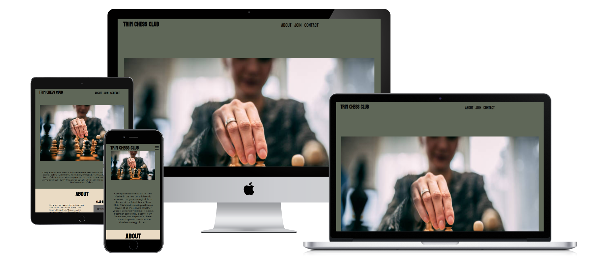
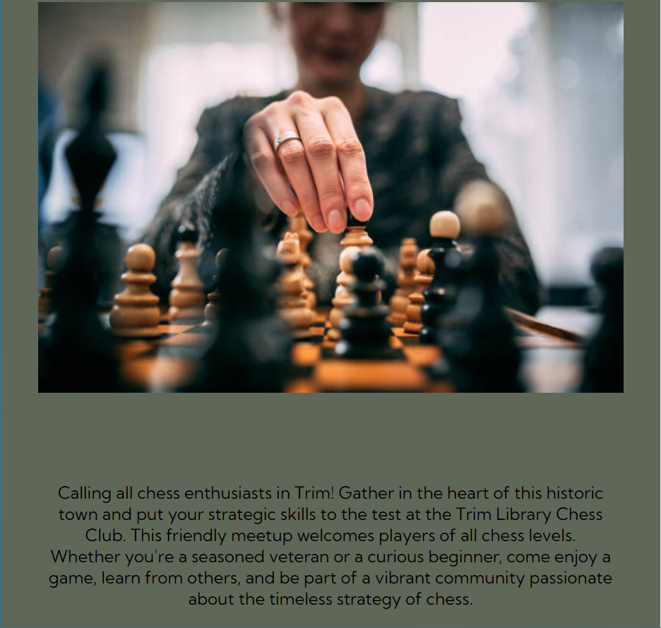
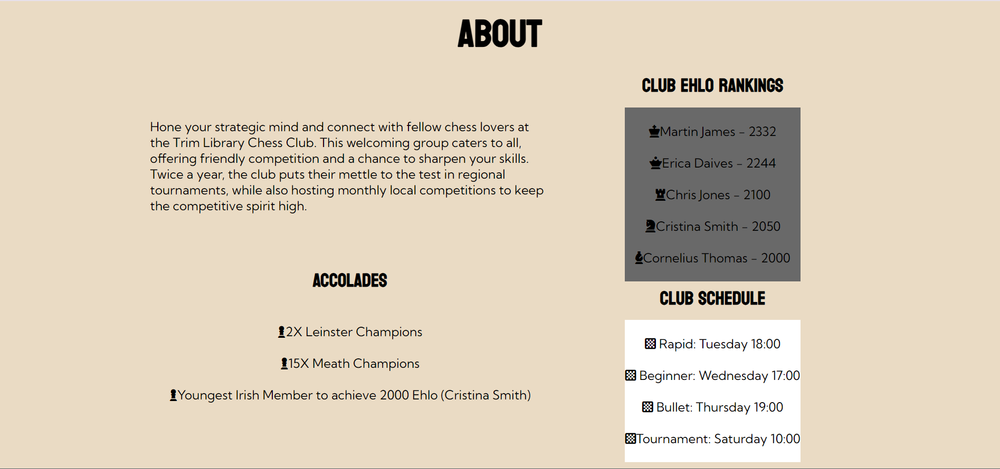
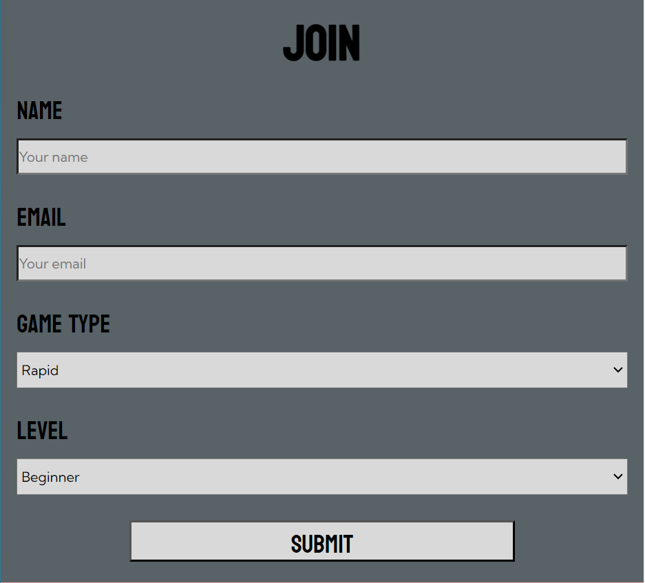
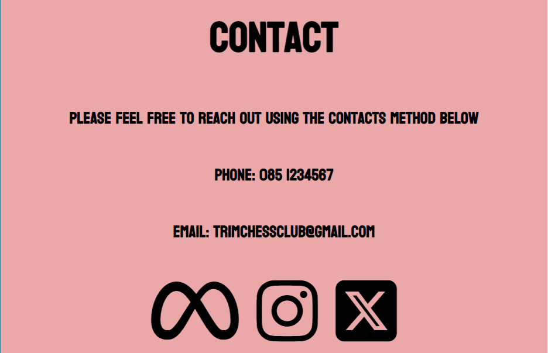
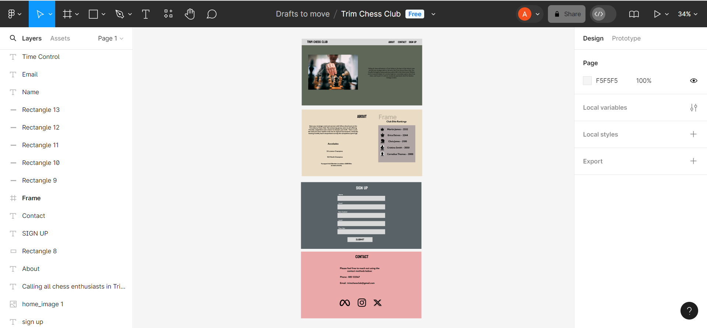
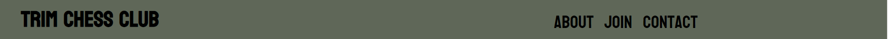
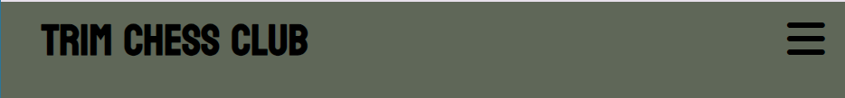
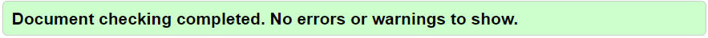
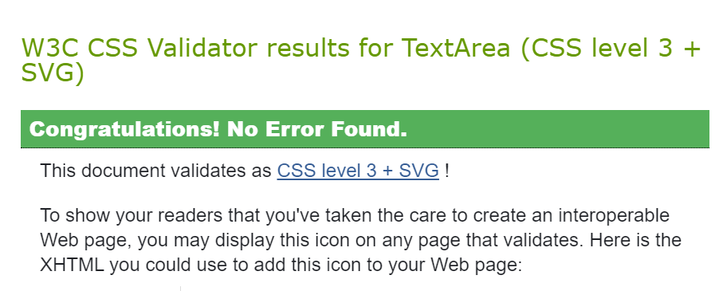

# Trim Chess Club

This website was created to establish an online presence for a chess club located in Trim, Co. Meath.

Included on this page is an introduction to the club, some of the accolades the club has achieved, a current ranking of the top members, a form to join the club and a contact section.

### User Stories

When developing this website I had the objectives of spreading the awareness of the club's existence in the surrounding areas. Below are some of the points which may be applicable to users of this site:

+ As another chess club/ governing body, I want to see other chess clubs in the country and challenge them to friendly matches/ tournaments.

+ As a competitor I want to see the level of the top players at this club.

+ As a player I want to see the times the club plays the different game types at.

+ As a user, I want to be able to sign up to a specific session. 

+ As a user, I want a way to contact the club.

+ As a user, I want to find this club on social media.

### Strategy

#### Scope

+ For website users (chess players, opposing clubs, governing bodies), I wanted to make it clear to them that there is a chess club established in this area and a basic overview of the club.

+ I wanted to make it easy for people to find out about the club.

#### Structure

Sections on the website:

1. Home Page: A hero image, short introduction and menu for navigation.

2. About: A short description of the club, accolades the club has achieved, current ranking of the club's top members, current club schedule.

3. Join: A form where players can enter their information to the club.

4. Contact: A place where players can find the phone number, email address and social media links for the club.

#### Skeleton

+ This wesite was designed to be simplistic and easy to read.

+ The design flows from top to bottom and each section includes a different background.

+ I used Figma to brain storm and come up with the websites layout. This software allowed me to develop each section seperately.

#### Surface

+ I selected earthy, neutral colors as backgrounds. These colors represent the historic nature of the game of chess and the town of Trim.

+ As the hero image I selected a high quality image of a chess player making a move.

+ For the list bullet markers I used chess icons from Font Awesome.

    + For the rankings I used chess pieces in descending order of power, eg King, Queen, Rook, Knight, Bishop.

    + For the accolades section I used the pawn icon.

    + For the club timetables I used the chess board icons. 

#### Technologies

1. HTML - To create the structure of the website

2. CSS - Add styles and effects to the existing struture

3. Figma - For brainstorming and seperating sections

### Features

#### Existing Features

+ Navigation Bar
    + The navigation bar at the top of the page.
    + The name of the website is at the top left of the page.
    + The navigation links of About, Join and Contact are on the right hand side of the screen.
    + When the screen size becomes smaller the navigation links become a menu navigation tool that saves space.

    + Navigation bar on larger screen
    

    + Navigation bar on smaller screen
    

+ Home
    + The home section features a hero image of a player making a move in a chess game.
    + This section also features a short description relating to the club.

+ Join
    + The join section has a form which allows players to input their name, email, preffered game type and current level.
    + Players can submit this information to the club 

+ Contact
    + Includes phone number and email information
    + Has functioning links to X, Meta and Instagram.

#### Potential Features

### Testing

#### Manual Testing

+ I tested the website on different browsers

+ I tested the website on my mobile phone

+ I confirmed the links on the website direct to which sections they represent.

+ I confirmed the submit button brings users to the Code Institute success page.

#### Validator Testing

1. HTML W3C Validator: Returned with no errors

2. CSS W3C Validator: Returned with no errors

3. Lighthouse Dev Tools

#### Bugs

##### Solved Bugs

+ When I first attempted to validate my HTML code I got errors as I was using ` ` element to add more space between list items in the about section.

+ Doing this returned an error as styles should be used to create this space and ` ` should be reserved only for text.

+ I removed the ` ` elements and instead used `margin` to create the desired space.

##### Unsolved Bugs 

+ No unsolved bugs remaining.

### Deployment

### Credits